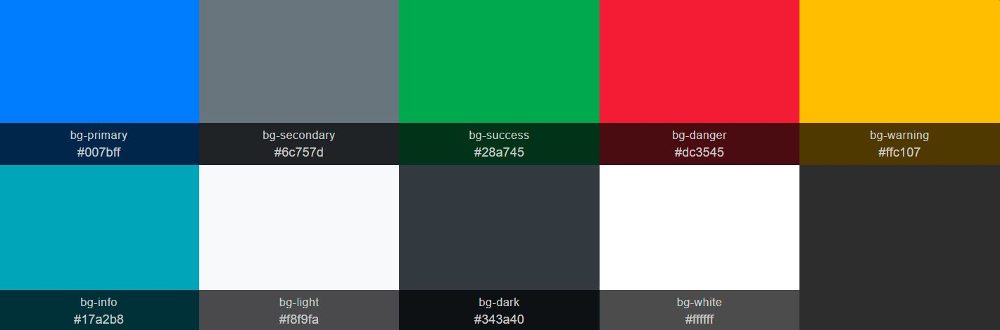
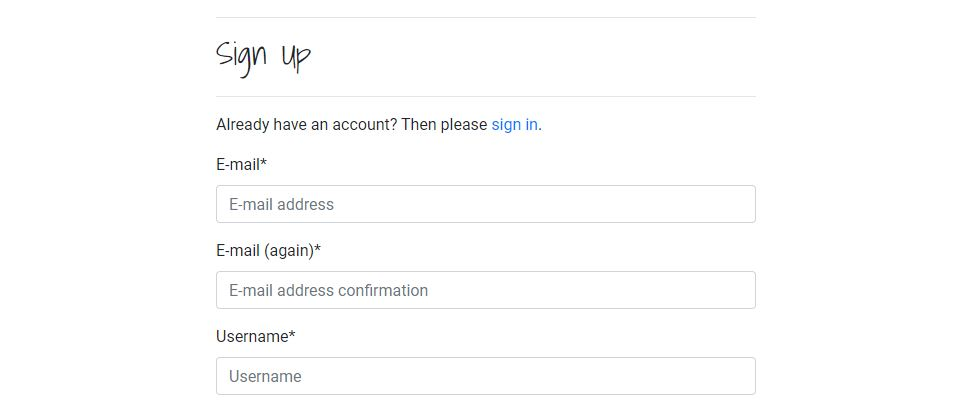
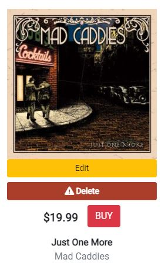
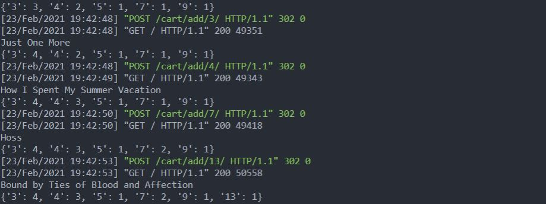
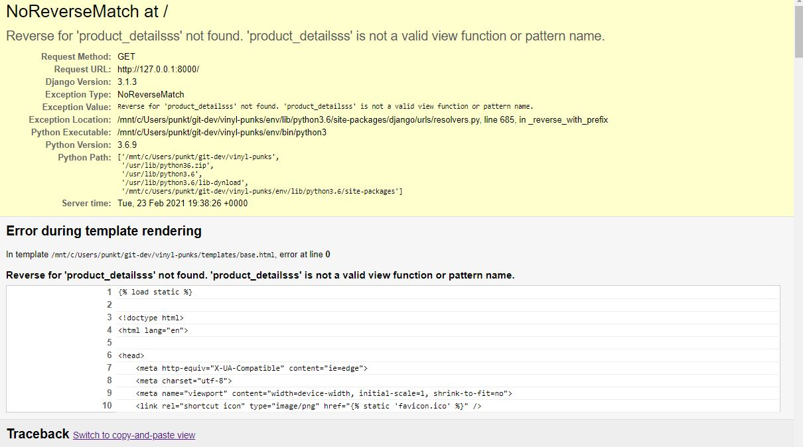
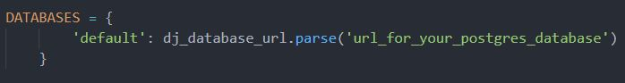
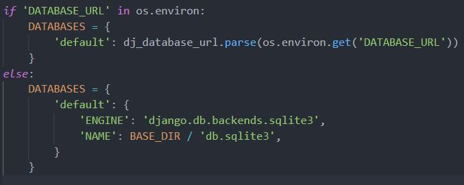
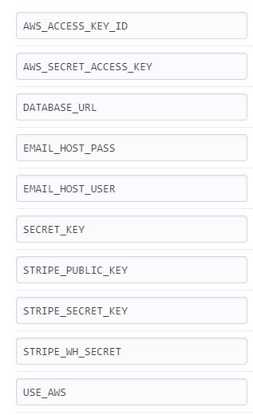

# Vinyl Punks

[Live website](https://vinyl-punks.herokuapp.com)

## Quick start

If you want to try out the app right away, you can either shop around without authenticating yourself, create a new user account or log in with superuser rights:

username: testuser  
password: allaccess

*It is time consuming to add albums to the inventory. Please do not delete albums already in the database. If you want to try out the full proccess of adding, updating and deleting an album, start with adding a new album and play around with that one. Thanks!*

## Introduction

Vinyl Punks is an fictional, online record store specializing in in the punk genre and vinyl format. For ease of use, registering for a profile is not needed to make a purchase. However, registering for a profiles opens the possibility to write reviews and rate the different albums. In addition, registering also let's a user store their shipping details and gives access to previous purchases.

*Note: This project builds upon large portions of the source code of a Django tutorial from Code Institute named [Boutique Ado](https://github.com/ckz8780/boutique_ado_v1).*

## Databases

The utilized database system for this project is [SQLite](https://www.sqlite.org/) in development and [PostgreSQL](https://www.postgresql.org/) in the deployed version. 

The diagram displays all the databases (models) in the project as well as their relationships. Some of the models also have associated functions which are important to understand to get a full understanding of all the databases functionality. This goes especially for the models of the checkout app.   
 
## UX

### General

The owner of the website(read: the team) recognizes the need for an online record store that specializes in the punk genre and the vinyl format. Vinyl as a format is on the rise, and punk as genre just won't die. These facts combined gives reason for the owner to believe that there's a market for such a record store.

Similarly, from a consumer's point of view, there's a need for a record store that specializes in providing music in the punk genre in the vinyl format. 

### Typography

The website uses two fonts from [Google Fonts'](https://fonts.google.com/) library called [Shadows Into Light](https://fonts.google.com/specimen/Shadows+Into+Light) and [Reenie Beanie](https://fonts.google.com/specimen/Shadows+Into+Light)

"Shadows Into Light" is used for most headings, while "Reenie Beanie" is only used for the main nav links. These two fonts were chosen for their handwritten, playful style and should somewhat reflect a 'punk' attitude.  All other text is [Roboto](https://fonts.google.com/specimen/Roboto?query=roboto).

### Colors

The website relies heavilly on bootstrap's color palette. Dark/black and red are used as primary colors. Since there's a profound presence of buttons across the website, it's important that these match the ever present header and navbar. "Danger" meets this criteria, and in the spirit of punk it breaks with a more traditional design where green ("success") has positive connotations and would typically be applied to "add to cart" and "checkout" buttons.

#### Danger
- Buttons for adding to cart
- X for deleting from cart
- X for deleting tracks (superuser view)
- All save buttons
- Checkout button
- Error toast

#### Warning
- Edit button for products (superuser view)

#### Info
- Header of info toast

#### Success
- Header of success toast

#### Light
- Background of every other element created by a template loop (comments, order history, tables)

### Bootstrap
[Bootstrap](https://getbootstrap.com) was chosen as CSS library for this project. There are several reasons for this: responsive grid, helper-classes and an excellent documentation are some of them. Since the main focus of this project has been working with django and backend in general, helper classes from bootstrap has be utilized as often and as much as possible, resulting in a relatively lean local CSS.

### User Stories

**Story number**|**User story**|**User type**
:-----:|:-----:|:-----:
1|I want to be able to easilly navigate around the website|All users
2|I want to be able to easilly filter albums by different categories and criterias|All users
3|I can search for an album or artist|All users
4|I can add an album to my cart immediately when displayed on screen|All users
5|I can display my cart without having to navigate away from where I currently am|All users
6|I can pay for my item and receive a confirmation on the order|All users
7|I want to be able to register for an account|All users
8|I can store mye checkout information for my next visit|Registered users
9|I can write, edit and delete reviews and ratings for albums|Registered users
10|I can view previous purchases as well as update my stored information|Registered users
11|I can add, update and delete a product outside the django admin|Superusers
12|I can add multiple tracks to an album at once|Superusers
13|I can remove tracks from an album outside the django admin|Superusers

### Wireframes

  [Products](https://github.com/thorole/vinyl-punks/blob/main/documentation/wireframes/Products.pdf) | [Products small/medium screen](https://github.com/thorole/vinyl-punks/blob/main/documentation/wireframes/Products_medium_and_small.pdf)
  
  [Album details](https://github.com/thorole/vinyl-punks/blob/main/documentation/wireframes/Album_details.pdf) | [Album details small screen](https://github.com/thorole/vinyl-punks/blob/main/documentation/wireframes/Album_details_small.pdf)
  
  [Cart](https://github.com/thorole/vinyl-punks/blob/main/documentation/wireframes/Cart.pdf)
  
  [Checkout](https://github.com/thorole/vinyl-punks/blob/main/documentation/wireframes/Checkout.pdf)
  
  [Profile](https://github.com/thorole/vinyl-punks/blob/main/documentation/wireframes/Profile.pdf)

## Features and views

There are three possible usertypes/views for the website:
- unregistered users
- registered users
- superusers (administrators)

The experience of the website is mostly the same for any type of users, however, there are some extra features available to registered users and even more, naturally, for superusers.

### Navigation
#### User story: 1 and 3

The navbar contains everything the user needs to navigate the site. It's sticky and breaks down to bootstraps mobile navbar on small screens.

### Sorting
#### User story: 2

The user can immediately sort the album selection on the landing page. Albums may also be sorted after the user has chosen to filter the selection via the navbar. 

### Albums display
#### User story: 4

The albums are displayed in a bootstrap grid and breaks down to 2 columns on small screens. The "BUY" button allows the user to add an album to the cart without clicking the album first to see it's details. It's also possible to add it to the cart after clicking an album to view it's details.

### Cart Preview
#### User story: 5

The cart preview allows a user to view the cart without navigating away from where the user currently is on the site. The preview is easilly opened/closed by clicking the cart button in the navbar. The cart preview also allows the user to remove albums from the cart. This is accomplished with ajax, thus no reload is needed.

*Note that on smaller screens, the cart preview is unavailable, and when clicking the cart button, the user is taken directly to the cart view.*

### Authentication
#### User story: 7

Authentication is handled by Allauth. Templates have mostly been left untouched, except for some minor adjustments. Allauth authentication enables a user to create an account, login and access features like reviews/ratings, order history and storing shipping information.

### Checkout
#### User story: 6 and 8

After the user has added products to the cart, he/she's able to go to the checkout page. Here the user will have to fill out an order form and card details. Make notice of the checkbox, which lets a registered user store their checkout information. Before proceeding, an overview of the cart is also displayed, including a button linking to the cart, allowing the user to make changes to the cart if needed.

After the user clicks the checkout button, a loading screen will be displayed while awaiting a response from Stripe. If the transfer is successful, the user will be redirected to a success page, and after 15 seconds, redirected back to the landing page. An email will also be sent to the email address that the user provided.

*The checkout app utilizes Stripe's webhook service as a double check to make sure the order was registered at Vinyl-Punks. In case a user closes the browser before the payment proccess completes, or any other incident that aborts the proccess occurs, Stripe sends a webhook to vinyl-punks with the payment information which in return checks if the same information is already stored or not. This more or less guarantees that Vinyl-Punks won't miss a paid order*

If Stripe for some reason declines the transfer, the user is taken back to the checkout page, and an error-message is displayed below the card input. ("Kortet er avvist" - "Card declined" in Norwegian)

### Reviews and ratings
#### User story: 8

Registered users can write reviews for any album. When writing a review, the user must also rate the album. Average rating for a particular album is calculated each time a rating is created, updated or deleted. Note that the rating and the review is stored in separate records, but are related to one another in a one-to-one relationship.

Editing a review/rating is done with ajax. This saves the user from any reloading or redirects.

### Profile
#### User story: 9

Registered users have access to a profile page. Here the user can update their shipping information (pre-filled on future checkouts).

The user can also view past purchases, and view their contents.

### Add, update and delete products
#### User story: 10
A superuser is able to add, update and delete products. To add a new album, the superuser can access this page via their "My account" icon in the header. This will take them to the "Add an Album" page.

 
 To update or delete an album, there's buttons for this beneath each album.

*Album images should always have equal width and height for consistency. At the moment there is no validation of the proportions of the uploaded image as the only users with access to this feature are store owners and they're unlikely to misuse the website.*

### Add tracks
#### User story: 11
A superuser can add tracks to an album either by clicking the edit button beneath the album, or via the "My Account" icon in the header. If done via the edit button, the correct album is already chosen and no select box is visible. If done via the "My Account" icon, an album must be chosen in the select box before the tracks can be added.

It's obviously possible to add single tracks via django's admin. However, that can be tedious, depending on the number of tracks. The add tracks view let's the user create (big plus sign) or remove (red X) as many input fields as needed, before posting to the server.

### Remove tracks
#### User story: 12
Tracks can easilly be removed from an album by clicking on the album to view the details. If there's tracks, a red X is displayed next to each one and lets the superuser delete the track.

### Features Left to Implement

All of the features that was planned for on this website was executed. However, there are almost an endless array of features that can be implemented to make the site even more functional. Here are a few ideas of features that would improve the site (in loosely prioritized order):

- Pagination
- Contact page
- Album-carousel with suggested albums based on what the user already has added to their cart.
- Coupon codes at checkout
- Track number (for correct sorting. Currently, the user has to add the tracks in the correct order.)

## Technologies Used

- [Django](https://www.djangoproject.com/)
- [Stripe](https://stripe.com/en-no)
- [VS Code](https://code.visualstudio.com/)
- [Flake 8](https://flake8.pycqa.org/en/latest/)
- [HTML5](https://www.w3.org/) 
- [CSS3](https://www.w3.org/)
- [Python](https://www.python.org/)
- [Pip](https://pip.pypa.io/en/stable/)
- [SQLite](https://www.sqlite.org/index.html)
- [postgreSQL](https://www.postgresql.org/)
- [JavaScript](https://www.javascript.com/)
- [jQuery](https://jquery.com/)
- [Bootstrap 4.4.1](https://getbootstrap.com/docs/4.4/getting-started/introduction/)
- [Google Fonts](https://fonts.google.com/)
- [Font Awsome](https://fontawesome.com/)
- [Git](https://git-scm.com/)
- [Github](https://www.github.com)
- [Heroku](https://id.heroku.com/)
- [AWS](https://aws.amazon.com/)
- [WSL | Ubuntu](https://ubuntu.com/wsl)

## Testing

The testing of the website, both in development and as a finished product has been done through manual testing. As the manual test documentation became quite extensive, it can be viewed in [this document](https://github.com/thorole/vinyl-punks/blob/main/documentation/testing/TESTING.md).

### Bug report

Through out development, there has been a series of minor and more complex bugs. The most important tool for debuggin has been printing information in the cli while the app is running. 

Debugging cart with print statements

Debugging erronous path with Django debugger

Other than this, printing variables directly on the templates has also been a method of debugging.

Currently, there's possibly one known bug related to the cart preview. On a couple of occasions throughout development, the delete icon(s) for the items in the cart has become unresponsive, meaning that the items won't be removed from the cart when the icon is clicked. In the later stages of the project, I haven't been able to reproduce the bug, and thus not found a cause of the bug or a solution.

Another problem is related to the cart view and updating quantities. It seems the problem affects ios devices. Normally, if a user enters anything else than an integer between 0-10 in the quantity input, a helpful error message is displayed beneath the input. However, on ios devices, the input accepts decimals. So, if you type "1,3", for example, there would be an error on the backend(which is expecting an integer). The current solution to this is a parsing to integer before validation and submitting. The alternative would be to display an error toast when the backend fails.

*Note: this bug only arises on physical ios devices. In chrome dev-tools, when for instance choosing an iphone, the input behaves as intended.*

### Testing and Responsiveness across browsers and devices
The website was built and tested in Chrome throughout the construction. In addition it has been tested
in Mozilla Firefox, MS Edge and Mac OS Safari. The website is responsive as intended across
all browsers used in testing.

The website has also been tested physically on iPhone S, ipad 2nd gen., iPhone 7 and Mi a2 Redmi note 7.
The website responds well to smaller screen sizes and no major problems have appeared. The site utilizes bootstrap's grid system and changes column sizing from small and up to large screens, depending on the view. During construction the site was constantly tested on phone sized
screen in the Chrome dev. tools to make sure it looked good and behaved as intended.

#### Tools used in testing
- [JsHint](https://jshint.com/)
- [W3C Markup Validation](https://validator.w3.org/) 
- [W3C CSS Validation](https://jigsaw.w3.org/css-validator/#validate_by_input) 
- [Accessibility checker](https://www.achecker.ca) (Multiple known problems, all related to use of `<i>` for icons.)
- [Chrome DevTools](https://developers.google.com/web/tools/chrome-devtools)
- [Pep-8 online checker](http://pep8online.com/) *Note that in code blocks and files that are automatically generated by Django, long lines and unused imports have been left untouched*

#### Lighthouse report

## Deployment

**This procedure was followed to deploy Vinyl Punks**

1. Log in to Heroku, click "New" > "Create new app"
2. Give the project a unique name, choose region and click "Create app".
3. Click the "Resources" tab and serach for and select Heroku Postgres. Then select the free plan.
4. In the cli, run `pip3 install dj_database_url` followed by `pip3 install psycopg2-binary`
5. Add `import dj_database_url` in your settings file.
6. Now, comment out django's default database configuration in settings.py and add this instead:

The postgres url can be found in the config vars at Heroku.

7. Migrate your databases to Heroku postgres by running `python3 manage.py migrate`. (If you have fixtures, now is a good time to load them to the new database with `python3 manage.py loaddata name_of_fixture`)
8. Create a new superuser for your deployed version by running `python3 manage.py createsuperuser`. Fill in the required details.
9. Now, uncomment django's default database configuration in settings.py and remove this:

 
10. To make things a bit more convenient when switching between development and production, add this to your database config:

11. Run `pip3 install gunicorn` 
12. Create a requirements file. In the cli it can be done by running the following command:
`pip3 freeze --local > requirements.txt`
13. Create a procfile. In the cli it can be done by running the following command: `echo web: gunicorn vinyl_punks.wsgi:application > Procfile`
14. Run `heroku login` to log in to Heroku.
15. If you plan on using another service than Heroku for hosting your static files, add `DISABLE_COLLECTSTATIC=1` to your config vars at Heroku. This can also be done by running `heroku config:set DISABLE_COLLECTSTATIC=1 --app vinyl-punks` from the cli.
16. Add the heroku app url to `ALLOWED_HOSTS = []` in settings.py. Make sure to also add you local host path to this list.
17. Set remote repo to heroku: `heroku git remote -a vinyl-punks`
18. Push to Heroku: `git push heroku master`
19. For automatic deploys from github, scroll down to "deployment method"-section. Choose "Github" for automatic deployment.
20. From the inputs below, make sure your github user is selected, and then enter the name for your repo. Click "search". When it finds the repo, click the "connect" button. 
21. Scroll back up and click "Deploy". Scroll down and click "Enable automatic deployment". 
22. Now, it's neccessary to add all the config variables to heroku:

*Note that the AWS variables are only relevant when using AWS S3 for serving static files.*
For an excellent guide to hosting your static django files at AWS S3, [please click here](https://testdriven.io/blog/storing-django-static-and-media-files-on-amazon-s3/). 

**To clone the repository, follow these instructions:**

1. Navigate to the [repository](https://github.com/thorole/vinyl-punks)
2. Click **Clone or download**
3. Copy the url from the **Clone or download** dropdown.
4. In cli, navigate to the folder where you want to clone the repository.
5. Type *git clone*, and then paste the URL you copied in Step 3.
6. Press Enter

*Note: You will have to install all the dependencies from [requirements](https://github.com/thorole/vinyl-punks/blob/main/requirements.txt) for the app to work. In the cli, you can run the command* 

`pip install -r requirements.txt`

*You will also have to set up an* `env.py` *file in the root directory of your project, and set up variables for STRIPE_PUBLIC_KEY, SECRET_KEY, STRIPE_SECRET_KEY, STRIPE_WH_SECRET and DEVELOPMENT. In addition, you will have to set up the local sqLite database.*

For more information, visit [Cloning a repository](https://help.github.com/en/github/creating-cloning-and-archiving-repositories/cloning-a-repository)
on github.

## Credits

### Content
All album images are taken from [Platekompaniet](https://www.platekompaniet.no) and [Amazon](https://www.amazon.com).

The missing album image was taken from [DeviantArt](https://www.deviantart.com/cmdrobot/art/No-album-art-no-cover-placeholder-picture-458050685)

The image used in the favicon and as default profile image was taken from [Vectorstock](https://www.vectorstock.com/royalty-free-vector/running-runner-man-marathon-logo-jogging-emblems-vector-13465761).

Image in 404 page was taken from [this](https://www.deviantart.com/rozina/art/Sad-punk-420542599) website.

### Acknowledgements

Vinyl Punks builds upon the "Boutique Ado"-tutorial from Code Institute. Core functionality like payment system is more or less unchanged from the tutorial. You can find the repository here:
[Boutique Ado](https://github.com/ckz8780/boutique_ado_v1)

Inspiration for the structural layout of the albums and album details was found here: [Platekompaniet](https://www.platekompaniet.no) (Norwegian).

Thanks to my mentor [Jonathan Munz](https://github.com/jpmunz) for guidance on the project and for providing online litterature.

